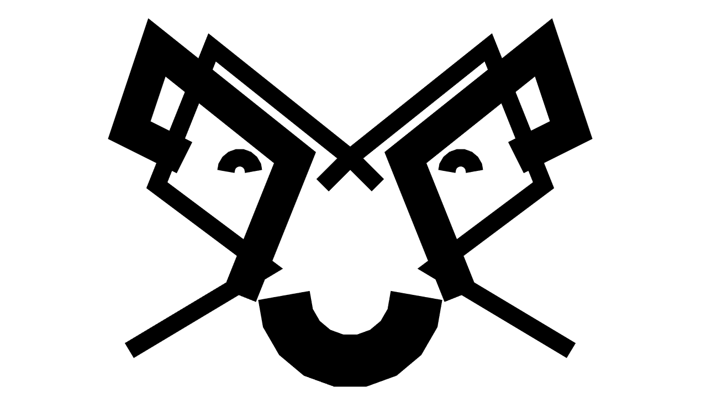

# REGL LineBuilder

[![Stability][stability-image]][stability-url]
[![Build Status][travis-image]][travis-url]
[![Code Style][style-image]][style-url]

[](./examples/basic.js)

Draw pretty lines in **WebGL** with the **Canvas2D** API.

## Example

```javascript
import createREGL from 'regl'
import mat4 from 'gl-mat4'
import { LineBuilder } from 'regl-line-builder'

const regl = createREGL()
const setupCamera = regl({
  uniforms: {
    view: mat4.identity([]),
    projection: ({ viewportWidth, viewportHeight }) => {
      const w = viewportWidth / 2
      const h = viewportHeight / 2
      return mat4.ortho([], -w, w, -h, h, 0, 10)
    }
  }
})

const lines = LineBuilder.create(regl, {
  stride: 2,
  maxSize: 300
})
const ctx = lines.getContext()

ctx.lineWidth = 1
ctx.beginPath()
ctx.moveTo(300, 300)
ctx.lineTo(-300, -300)
ctx.lineTo(-300, -500)
ctx.lineTo(300, -300)
ctx.closePath()
ctx.stroke()

ctx.lineWidth = 2
ctx.beginPath()
ctx.moveTo(-300, 300)
ctx.lineTo(300, -300)
ctx.lineTo(300, -500)
ctx.lineTo(-300, -300)
ctx.closePath()
ctx.stroke()

regl.frame(({ tick }) => {
  const { sin } = Math
  const t0 = sin(tick * 0.1) * 0.5 + 0.5

  setupCamera(() => {
    regl.clear({
      color: [1, 1, 1, 1],
      depth: 1
    })

    lines.draw({
      color: [0, 0, 0],
      thickness: (8 / 100) + t0 * (6 / 100),
      miterLimit: 1
    })
  })
})

```

## Install

```
npm install regl-line-builder --save
```

## License
(c) 2017 Jay Weeks. MIT License  
(c) 2015 Matt DesLauriers where noted. MIT License

[stability-url]: https://nodejs.org/api/documentation.html#documentation_stability_index
[stability-image]: https://img.shields.io/badge/stability-experimental-orange.svg?style=flat-square
[travis-url]: https://travis-ci.org/jpweeks/regl-line-builder
[travis-image]: https://img.shields.io/travis/jpweeks/regl-line-builder/master.svg?style=flat-square
[style-url]: https://standardjs.com
[style-image]: https://img.shields.io/badge/code%20style-standard-brightgreen.svg?style=flat-square
